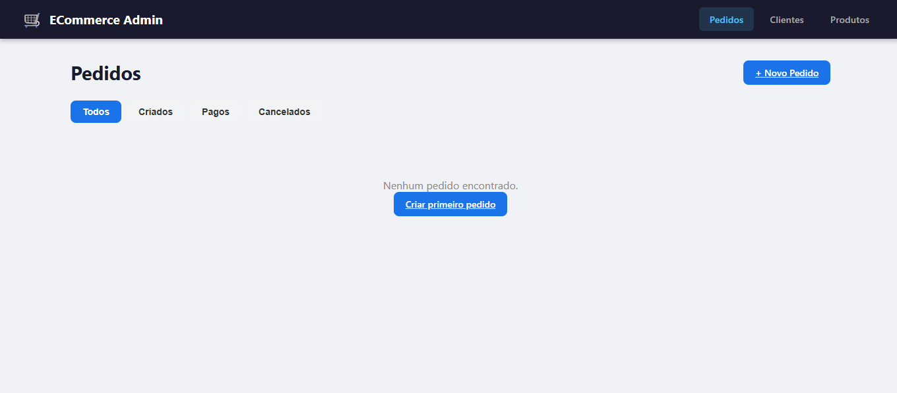
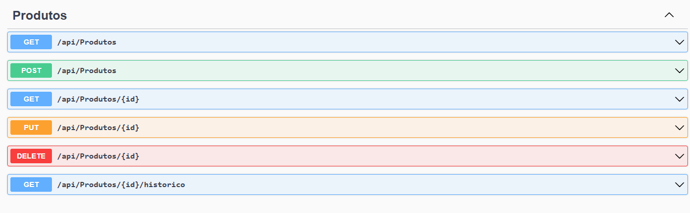

# 🛒 ECommerce — Sistema de Pedidos

Sistema de gerenciamento de pedidos de e-commerce fictício desenvolvido com **C# .NET** no backend e **Angular 18** no frontend.

---

## 🖥️ Telas do Sistema

### Frontend

**Pedidos**


**Clientes**


**Produtos**


---

### Documentação da API (Swagger)

**Endpoints de Pedidos**


**Endpoints de Clientes**


**Endpoints de Produtos**


---

## 🚀 Como Rodar o Projeto

### Pré-requisitos

- [.NET SDK](https://dotnet.microsoft.com/download) (versão 6 ou superior)
- [Node.js LTS](https://nodejs.org)
- Angular CLI 18: `npm install -g @angular/cli@18`

---

### 1. Backend
```bash
cd backend/ECommerce.API
dotnet restore
dotnet run
```

API disponível em: `http://localhost:5000`  
Swagger em: `http://localhost:5000/swagger`

---

### 2. Testes
```bash
cd backend/ECommerce.Tests
dotnet test
```

---

### 3. Frontend
```bash
cd frontend
npm install
ng serve
```

Acesse: `http://localhost:4200`

> ⚠️ O backend precisa estar rodando antes de abrir o frontend.

---

## 🗂️ Estrutura do Projeto
```
ecommerce/
├── backend/
│   ├── ECommerce.API/
│   │   ├── Controllers/   # Endpoints REST
│   │   ├── Services/      # Regras de negócio
│   │   ├── Interfaces/    # Contratos / injeção de dependência
│   │   ├── Models/        # Entidades do domínio
│   │   ├── DTOs/          # Objetos de transferência de dados
│   │   ├── Data/          # Contexto do banco de dados
│   │   └── Program.cs     # Configuração da aplicação
│   └── ECommerce.Tests/   # Testes unitários (xUnit)
│
└── frontend/
    └── src/app/
        ├── components/    # Telas (Clientes, Produtos, Pedidos)
        ├── services/      # Comunicação com a API
        └── models/        # Interfaces TypeScript
```

---

## ⚙️ Funcionalidades

- Cadastro, edição e remoção de **clientes** e **produtos**
- Criação de **pedidos** com múltiplos produtos
- Confirmação de **pagamento** e **cancelamento** de pedidos
- Filtro de pedidos por status: `Criado`, `Pago` ou `Cancelado`
- **Histórico** de todas as alterações por entidade
- Controle de **estoque** automático ao criar ou cancelar pedidos

---

## 🧪 Testes Unitários

Cobertos com **xUnit + Moq + FluentAssertions**:

- Criar pedido com dados válidos
- Bloquear pedido sem estoque
- Pagar e cancelar pedido
- Impedir cancelamento de pedido já pago
- Devolver estoque ao cancelar
- Filtrar pedidos por status
- Criar, atualizar e remover clientes e produtos
